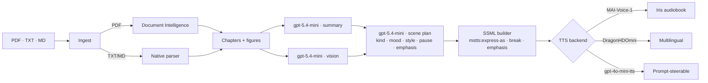

<div align="center">
  
  <h1>HearThat</h1>
  <p><strong>Turn PDF books into multi-voice audiobooks with Azure Speech &amp; Azure OpenAI.</strong></p>
  <p>
    
    
    
  </p>
</div>

---

HearThat takes a PDF, plain-text or Markdown book, extracts and summarises every
chapter with Azure OpenAI, asks a small LLM to label each paragraph
(heading / dialog / narration / action + mood + style) and then narrates it with
**MAI-Voice-1** (preview), **DragonHD / Omni**, or the prompt-steerable
**gpt-4o-mini-tts** model. A small FastAPI + HTMX UI lets you upload books, watch
live progress, and listen to the result. Authentication is passwordless
(Entra ID) in production with an opt-in API-key fallback for local development.

## ✨ Features

- 📄 **Multi-format ingestion** — PDF (Document Intelligence `prebuilt-layout` + `pypdf` fallback), `.txt` and `.md` directly, with demo upload limits and inline file validation
- 🧠 **Reasoning-grade summaries** with `gpt-5.4-mini` (`reasoning_effort=minimal`)
- 🎬 **Scene-aware narration** — a small LLM step labels every paragraph (heading / dialog / narration / action, mood, `mstts:express-as` style, pause and emphasis) **before** SSML is built, with graceful regex-only fallback
- 🎙️ Three TTS backends: **MAI-Voice-1** (Iris, narration), **DragonHDOmni** (700+ voices), **gpt-4o-mini-tts** (prompt-steerable)
- 🖼️ **Multimodal vision** describes figures so the narrator mentions them naturally
- 🌍 **Batch translation** via Azure AI Translation Document
- 📊 **Live progress UI** — phase-aware status (`Reading the document` → `Understanding chapters` → `Narrating`), animated spinner, percentage bar, HTMX polling
- ⚙️ **Env-aware settings page** — endpoints visible everywhere; API-key fields only appear in development mode (`HEARTHAT_ENV != prod`)
- 🔐 **Passwordless first** — `DefaultAzureCredential` everywhere, with optional `AZURE_*_API_KEY` fallback gated to development

## 🌍 Regions & models (snapshot 17 May 2026)

> Recommended deployment: Azure OpenAI in `swedencentral` + Azure Speech in `eastus`
> (covers MAI-Voice-1 preview). Live availability:
> https://model-availability.azurewebsites.net/

| Service | Model / Voice | Role | Region | Status |
|---|---|---|---|---|
| Azure OpenAI | `gpt-5.4-mini` | Summaries (reasoning) + vision | `swedencentral`, `eastus2` | GA |
| Azure OpenAI | `gpt-4.1-mini` | Non-reasoning fallback | `swedencentral`, `francecentral`, `westeurope` | GA |
| Azure OpenAI | `gpt-4o-mini-tts` | Prompt-steerable TTS | `swedencentral`, `eastus2` | GA |
| Azure OpenAI | `whisper` / `gpt-4o-mini-transcribe` | STT (notebooks) | `swedencentral`, `eastus2` | GA |
| Azure Speech | **`en-us-Iris:MAI-Voice-1`** ⭐ | Default audiobook narrator | `eastus` | Preview |
| Azure Speech | `en-US-Ava:DragonHDOmniLatestNeural` | Multilingual fallback | `eastus2`, `westus2`, `westeurope` | GA |
| Azure Speech | LLM Speech (transcription + translation) | Bonus `transcribe` module | Foundry Speech regions | Preview |
| Document Intelligence | `prebuilt-layout` | PDF extraction | `swedencentral` (co-loc) | GA |
| Translator | Document Translation 1.1 | Notebook 03 | `swedencentral` | GA |

## 🚀 Quickstart

```powershell
# 1. Install (uv: https://docs.astral.sh/uv/)
uv sync

# 2. Configure endpoints (no API keys needed in production)
copy .env.example .env

# 3. Sign in once — DefaultAzureCredential picks this up
az login

# 4a. Web UI (FastAPI + HTMX)
uv run hearthat ui            # http://127.0.0.1:8000

# 4b. CLI
uv run hearthat run data/samples/screentime/*.pdf --backend azure_speech_mai
uv run hearthat tts-openai "Welcome to HearThat" --instructions "warm storyteller"
```

### Development mode (API keys allowed)

Locally, `HEARTHAT_ENV` defaults to `dev`, which makes the **Settings** page
expose masked key fields when Entra ID sign-in is not convenient:

```env
HEARTHAT_ENV=dev                       # set to "prod" to hide all key fields
AZURE_OPENAI_API_KEY=...               # only used when HEARTHAT_ENV != prod
AZURE_SPEECH_API_KEY=...
AZURE_DOCINTEL_API_KEY=...
AZURE_TRANSLATOR_API_KEY=...
```

In production (`HEARTHAT_ENV=prod`) these fields are hidden in the UI and
ignored on save — only `DefaultAzureCredential` is used.

## 🐳 Docker

```powershell
docker compose build
docker compose up                              # UI on :8000
docker compose --profile notebooks up          # UI + Jupyter Lab on :8888
```

`~/.azure` is mounted read-only so `DefaultAzureCredential` works inside the
container without copying credentials.

## 📓 Notebooks

The `notebooks/` folder contains three runnable demos sharing the same package:

1. [`01_ingest_and_summarize.ipynb`](notebooks/01_ingest_and_summarize.ipynb) — PDF → chapters → summaries
2. [`02_text_to_speech.ipynb`](notebooks/02_text_to_speech.ipynb) — MAI-Voice-1 vs DragonHDOmni vs gpt-4o-mini-tts
3. [`03_translate.ipynb`](notebooks/03_translate.ipynb) — Document Translation

Register the kernel once:

```powershell
uv run python -m ipykernel install --user --name hearthat --display-name "HearThat (uv)"
```

## 🏗️ Architecture



## 📚 Resources

- Live model availability: https://model-availability.azurewebsites.net/
- [MAI-Voice-1 (preview)](https://learn.microsoft.com/en-us/azure/ai-services/speech-service/mai-voices)
- [LLM Speech (preview)](https://learn.microsoft.com/en-us/azure/ai-services/speech-service/llm-speech?tabs=new-foundry%2Cwindows&pivots=ai-foundry)
- [HD voices (DragonHD / Omni / Flash)](https://learn.microsoft.com/en-us/azure/ai-services/speech-service/high-definition-voices)
- [Batch Synthesis API](https://learn.microsoft.com/en-us/azure/ai-services/speech-service/batch-synthesis)
- [Azure OpenAI TTS quickstart](https://learn.microsoft.com/en-us/azure/ai-services/openai/text-to-speech-quickstart)

## 🤝 Contributing

See [`docs/DEVELOPMENT.md`](docs/DEVELOPMENT.md) for the full dev setup
(local launch, Service Principal fallback to avoid `az login`, RBAC,
troubleshooting).

```powershell
uv sync --all-extras
uv run pre-commit install
uv run ruff check . ; uv run mypy src ; uv run pytest -q
```

## 📝 License

MIT
